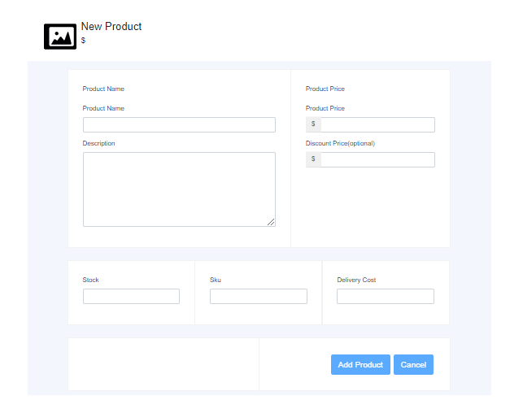
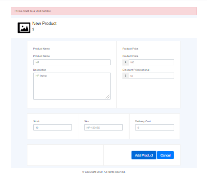
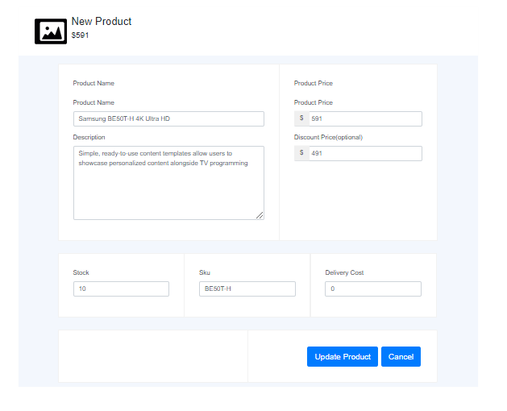

---
---

# Add/Update Product

## Document History

| **Version Number** |  **Date**  | **Edited by** | **Change/Comments**  |
| :----------------: | :--------: | :-----------: | :------------------: |
|        1.0         | 11-09-2020 |  Deepak Shah  | Intial Documentation |

## 1.0 Document Purpose and target group

This document is a part of the add-product documentation packages for add/update product.

## Introduction

```
This is a feature where vendor can add or update the product details.
```

### Screen (Add Product- 001)

**Layout**

```
Below layout allow vendor to add product.
```



```
Below layout shows error message while adding product.
```



**Element Definition**

|   **Element Name**   |          **Discription**          | **Data Type** |    **Label Element**     | **Plaveholder Key** |      **Displayed**       | **Mandatory** | **Enabled** | **Default** | **Tab Order** |
| :------------------: | :-------------------------------: | :-----------: | :----------------------: | :-----------------: | :----------------------: | :-----------: | :---------: | :---------: | :-----------: |
|  product-name-input  |       specify product name        |     Text      |       Product Name       |         N/A         |       Product Name       |      Yes      |     Yes     |     N/A     |       0       |
| product-price-input  |       Specify product price       |    Number     |      Product Price       |         N/A         |      Product Price       |      Yes      |     Yes     |     N/A     |       0       |
|  description-input   |    Specify product discription    |     Text      |       Description        |         N/A         |       Description        |      Yes      |     Yes     |     N/A     |       0       |
| discount-price-input |       Specify product price       |    Number     | Discount Price(optional) |         N/A         | Discount Price(optional) |      Yes      |     Yes     |     N/A     |       0       |
|     stock-input      | Spedify product stock availablity |    Number     |          Stock           |         N/A         |          Stock           |      Yes      |     Yes     |     N/A     |       0       |
|  product-code-input  |       Specify product code        |     Text      |           Sku            |         N/A         |           Sku            |      Yes      |     Yes     |     N/A     |       0       |
| delivery-cost-input  |   Specify product delivery cost   |    Number     |      Delivery Cost       |         N/A         |      Delivery Cost       |      Yes      |     Yes     |     N/A     |       0       |
|  add-product-button  |            Add Product            |    Submit     |           N/A            |         N/A         |       Add Product        |      Yes      |     No      |     N/A     |       0       |
|    cancel-button     |      Redirect to back screen      |    Submit     |           N/A            |         N/A         |          Cancel          |      Yes      |     yes     |     N/A     |       0       |

**Actions**

|  **Element Name**  | **User Action** |   **System Action**    | **Status** |
| :----------------: | :-------------: | :--------------------: | :--------: |
| add-product-button |      Click      |      Add product       |  Disabled  |
|   cancel-button    |      Click      | Rediect to back screen |  Disabled  |

**Localization**

| **Element** | **Localization Key** | **English Text** | **Other language Text** |
| :---------: | :------------------: | :--------------: | :---------------------: |
|     N/A     |         N/A          |       N/A        |           N/A           |

**Error Message**

|  **Discription**  |    **Trigger**     |
| :---------------: | :----------------: |
| Must not be empty | Depends on backend |

### Screen (Update Product- 001)

**Layout**



```
The above layout allow vendor to update product.
```

**Element Definition**

|   **Element Name**    |          **Discription**          | **Data Type** |    **Label Element**     | **Plaveholder Key** |      **Displayed**       | **Mandatory** | **Enabled** | **Default** | **Tab Order** |
| :-------------------: | :-------------------------------: | :-----------: | :----------------------: | :-----------------: | :----------------------: | :-----------: | :---------: | :---------: | :-----------: |
|  product-name-input   |       specify product name        |     Text      |       Product Name       |         N/A         |       Product Name       |      Yes      |     Yes     |     N/A     |       0       |
|  product-price-input  |       Specify product price       |    Number     |      Product Price       |         N/A         |      Product Price       |      Yes      |     Yes     |     N/A     |       0       |
|   description-input   |    Specify product discription    |     Text      |       Description        |         N/A         |       Description        |      Yes      |     Yes     |     N/A     |       0       |
| discount-price-input  |       Specify product price       |    Number     | Discount Price(optional) |         N/A         | Discount Price(optional) |      Yes      |     Yes     |     N/A     |       0       |
|      stock-input      | Spedify product stock availablity |    Number     |          Stock           |         N/A         |          Stock           |      Yes      |     Yes     |     N/A     |       0       |
|  product-code-input   |       Specify product code        |     Text      |           Sku            |         N/A         |           Sku            |      Yes      |     Yes     |     N/A     |       0       |
|  delivery-cost-input  |   Specify product delivery cost   |    Number     |      Delivery Cost       |         N/A         |      Delivery Cost       |      Yes      |     Yes     |     N/A     |       0       |
| update-product-button |      Update product details       |    Submit     |           N/A            |         N/A         |      Update Product      |      Yes      |     yes     |     N/A     |       0       |
|     cancel-button     |      Redirect to back screen      |    Submit     |           N/A            |         N/A         |          Cancel          |      Yes      |     yes     |     N/A     |       0       |

**Actions**

|   **Element Name**    | **User Action** |   **System Action**    | **Status** |
| :-------------------: | :-------------: | :--------------------: | :--------: |
| update-product-button |      Click      | Update product details |  Enabled   |
|     cancel-button     |      Click      | Rediect to back screen |  Enabled   |

**Localization**

| **Element** | **Localization Key** | **English Text** | **Other language Text** |
| :---------: | :------------------: | :--------------: | :---------------------: |
|     N/A     |         N/A          |       N/A        |           N/A           |

**Error Message**

| **Discription** | **Trigger** |
| :-------------: | :---------: |
|       N/A       |     N/A     |
