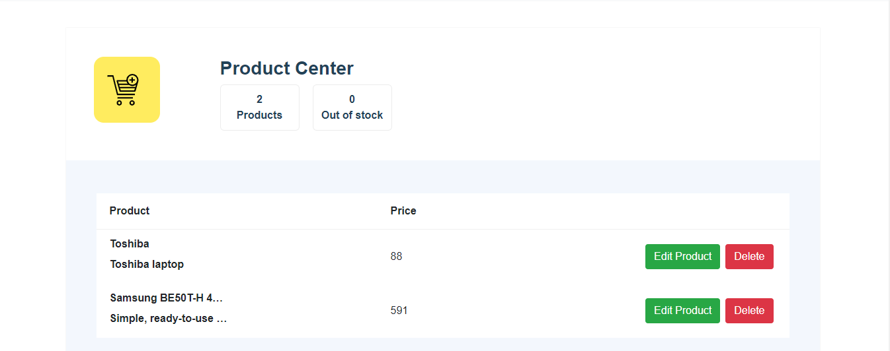
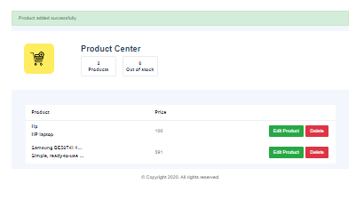
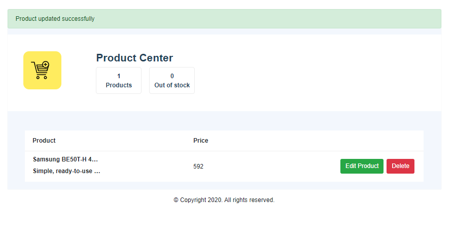
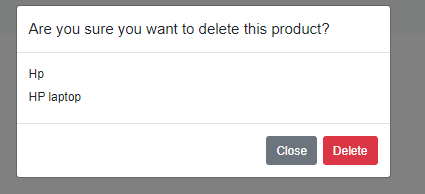
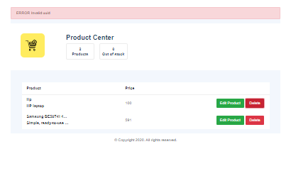
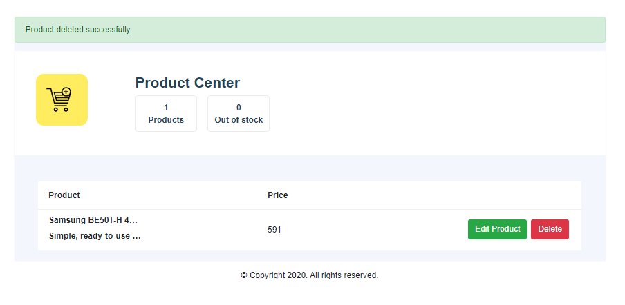

---
---

# Home : Product List

## Document History

| **Version Number** |  **Date**  | **Edited by** | **Change/Comments**  |
| :----------------: | :--------: | :-----------: | :------------------: |
|        1.0         | 11-09-2020 |  Deepak Shah  | Intial Documentation |

# 1.0 Document Purpose and target group

This document is a part of the list documentation packages for Product list.

**Introduction**

```
This is a website where vendor can have a list of products available. Vendor also can add, update and delete product.
```

**Screen (Product List- 001)**

**Layout**

```
The below layout canains all the product list with action edit and delete.
```



```
The below layout shows success scenario of add product.
```



```
The below layout shows success scenario of update product.
```



```
The below layout shows confirmation popup of delete product.
```



```
The below layout shows error scenario of delete product.
```



```
The below layout shows success scenario of delete product.
```



**Element Definition**

|      **Element Name**      |         **Discription**         | **Data Type** | **Label Element** | **Plaveholder Key** | **Displayed** | **Mandatory** | **Enabled** | **Default** | **Tab Order** |
| :------------------------: | :-----------------------------: | :-----------: | :---------------: | :-----------------: | :-----------: | :-----------: | :---------: | :---------: | :-----------: |
| confirmation-delete-button | Open delete confirmation popup  |    Button     |        N/A        |         N/A         |    Delete     |      Yes      |     Yes     |     N/A     |       0       |
|       update-button        |          Edit Product           |    Button     |        N/A        |         N/A         | Edit Product  |      Yes      |     Yes     |     N/A     |       0       |
|        close-button        | Close delete confirmation popup |    Button     |        N/A        |         N/A         |     Close     |      Yes      |     Yes     |     N/A     |       0       |
|       delete-button        |         Delete Product          |    Button     |        N/A        |         N/A         |    Delete     |      Yes      |     Yes     |     N/A     |       0       |

**Actions**

|      **Element Name**      | **User Action** |        **System Action**        | **Status** |
| :------------------------: | :-------------: | :-----------------------------: | :--------: |
| confirmation-delete-button |      Click      |    Open Confirmantion Popup     |  Enabled   |
|       update-button        |      Click      |    Rediect to update feature    |  Enabled   |
|        close-button        |      Click      | Close delete confirmation popup |  Enabled   |
|       delete-button        |      Click      |         Delete Product          |  Enabled   |

**Localization**

| **Element** | **Localization Key** | **English Text** | **Other language Text** |
| :---------: | :------------------: | :--------------: | :---------------------: |
|     N/A     |         N/A          |       N/A        |           N/A           |

**Error Message**

| **Discription** |    **Trigger**     |
| :-------------: | :----------------: |
|  invalid uuid   | Depends on backend |
